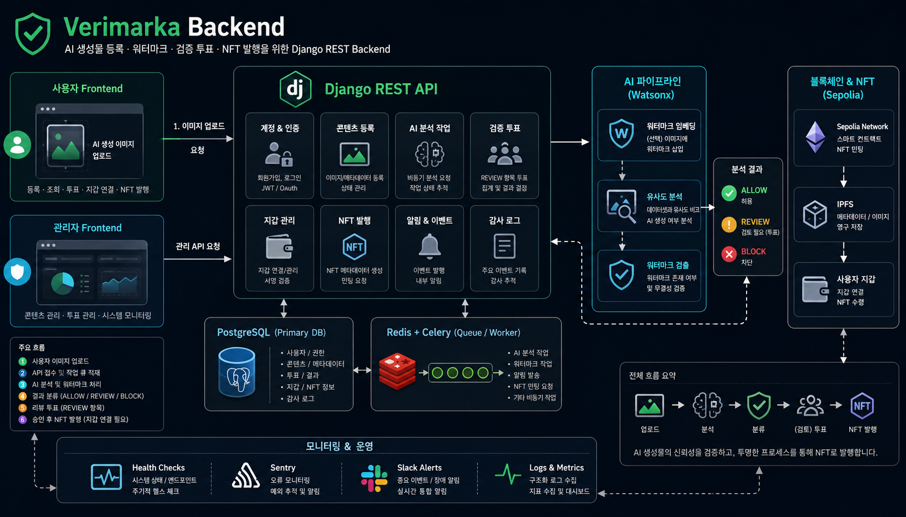
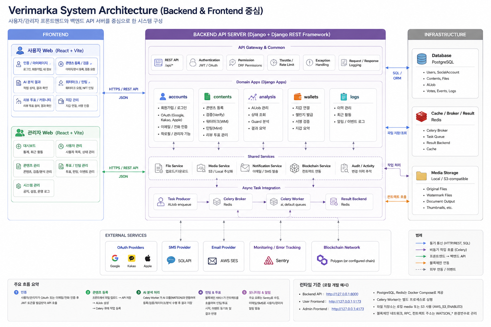
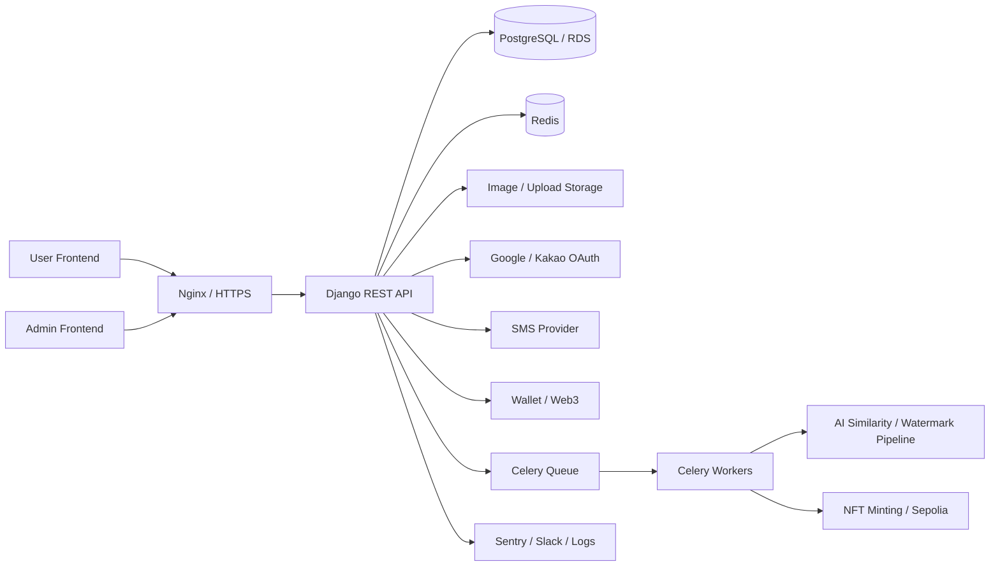

# Verimarka Backend

AI 저작물의 등록 가능성 판정, 워터마크 삽입, NFT 발급, 투표 검증 흐름을 제공하는 Django 기반 백엔드입니다.

기존 개발/운영 인수인계 문서는 [HANDOFF.md](./HANDOFF.md)에 보존했습니다.

## 1. 프로젝트 한 줄 소개

Verimarka는 AI 생성 이미지의 저작권 등록 가능성을 분석하고, 워터마크와 NFT 발급을 통해 저작물의 소유 및 검증 기록을 남기는 서비스입니다.

## 2. 개발 배경

AI 생성물이 빠르게 늘어나면서 원본성, 소유권, 등록 가능성, 검증 이력을 서비스 안에서 함께 다룰 필요가 생겼습니다. Verimarka는 AI 분석 결과를 기준으로 등록 가능 여부를 `ALLOW`, `REVIEW`, `BLOCK`으로 나누고, 필요한 경우 사용자 투표와 블록체인 기록을 연결해 저작물 등록 이후의 신뢰 흐름까지 관리하도록 설계했습니다.

## 3. 주요 기능

- 이메일, Google, Kakao 기반 회원가입/로그인
- JWT 인증, 토큰 갱신, 내 정보 조회/수정, 회원 탈퇴
- 이메일 인증, SMS 본인인증, 미인증 사용자 접근 제한
- AI 저작물 이미지 업로드 및 등록 가능 여부 판정
- `ALLOW`, `REVIEW`, `BLOCK` 상태별 후속 처리
- 워터마크 삽입, 워터마크 이미지 다운로드, 추후 NFT 발급
- REVIEW 상태 투표 생성, 참여, 72시간 이후 종료 처리
- 투표 결과 기반 워터마크/NFT 발급 권한 제어
- 지갑 등록 및 NFT 발급 기록 관리
- Celery/Redis 기반 AI 작업 비동기 처리
- request id 기반 로깅, Sentry, Slack 알림, health API
- GitHub Actions, Docker, Nginx 기반 배포 자동화

## 전체구조

## 4. 기술 스택

- Backend: Django, Django REST Framework, Simple JWT
- Database/Queue: PostgreSQL, Redis, Celery
- Blockchain: Web3.py, Ethereum Sepolia 테스트넷
- Auth/External: Google OAuth, Kakao OAuth, SMS 인증, 이메일 인증
- Infra: Docker Compose, Nginx, Let's Encrypt, AWS EC2, AWS RDS
- Observability: Django logging, Sentry, Slack 알림, request id 추적
- Quality: Ruff, pre-commit, GitHub Actions

## 5. 시스템 아키텍처 그림

## 6. 역할 분담
- 박준서: AI 담당
- 박민정: 웹 풀스택 담당
- 임윤수: 블록체인 담당

## 7. 기술적으로 고민한 점

- AI 판정 결과를 단순 성공/실패가 아니라 `ALLOW`, `REVIEW`, `BLOCK` 상태로 분리해 사용자 경험과 권한 처리를 명확히 했습니다.
- 시간이 오래 걸리는 AI 분석, 검증, 워터마크 삽입 작업은 Celery/Redis 큐로 분리해 API 응답 지연과 서버 부하를 줄였습니다.
- 지갑이 없는 사용자도 이미지 워터마크 삽입까지는 가능하게 하고, NFT 발급은 지갑 연결 이후 이어서 진행할 수 있도록 흐름을 나눴습니다.
- 운영 로그에는 request id를 포함해 사용자 프론트, 관리자 프론트, 백엔드 오류를 한 흐름으로 추적할 수 있게 했습니다.
- 배포 실패 시 헬스체크와 롤백 전략을 함께 검토해 운영 장애 대응 가능성을 높였습니다.

## 8. 트러블슈팅 / 성과

- OAuth code를 백엔드에서 토큰으로 교환하도록 구현해 클라이언트에 민감한 인증 흐름이 과도하게 노출되지 않도록 정리했습니다.
- 이메일 인증에는 Redis TTL을 적용하고, SMS 인증에는 일 요청 횟수와 인증 제한 시간을 둬 인증 남용 가능성을 줄였습니다.
- 투표 종료 시점을 사용자의 최초 상세 조회와 연결해 별도 스케줄러 없이 72시간 만료 처리를 안정적으로 수행하도록 구성했습니다.
- 워터마크 삽입 후 즉시 NFT를 발급하지 않아도 나중에 이어서 발급할 수 있도록 기록 상태를 분리했습니다.
- Sentry와 Slack 알림, 프론트/백엔드 오류 로그를 연결해 운영 중 문제 파악 시간을 줄일 수 있는 기반을 만들었습니다.

## 9. 실행 방법

실행 방법은 [docs/SETUP.md](./docs/SETUP.md)를 참고하세요.

