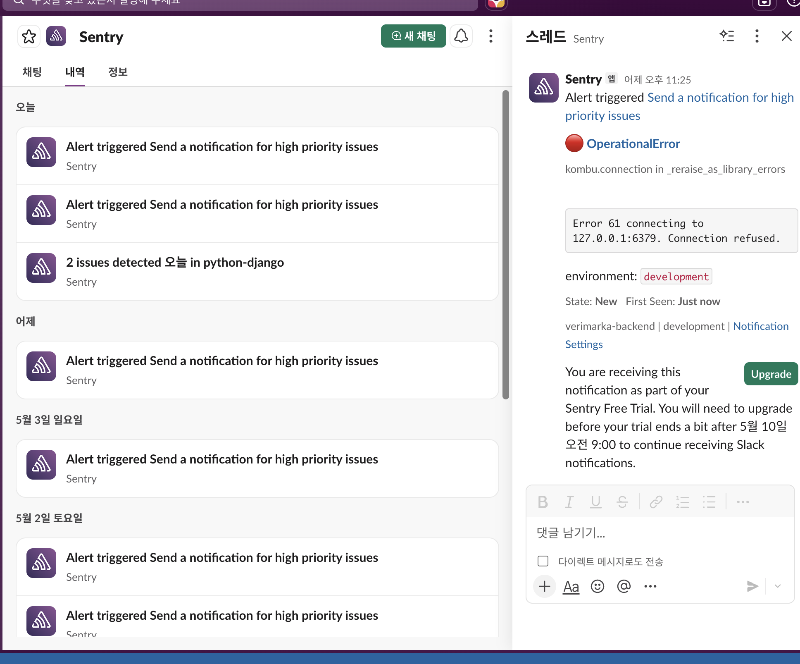

# Verimarka Backend

AI 저작물의 등록 가능성 판정, 워터마크 삽입, 문서 등록/검증, NFT 발급, 투표 검증 흐름을 제공하는 Django 기반 백엔드입니다.

기존 개발/운영 인수인계 문서는 [HANDOFF.md](./HANDOFF.md)에 보존했습니다.

## 1. 프로젝트 한 줄 소개

Verimarka는 AI 생성 이미지와 문서의 등록 가능성을 분석하고, 워터마크와 블록체인 기록을 통해 저작물의 소유 및 검증 이력을 남기는 서비스입니다.

## 2. 개발 배경

AI 생성물이 빠르게 늘어나면서 원본성, 소유권, 등록 가능성, 검증 이력을 서비스 안에서 함께 다룰 필요가 생겼습니다. Verimarka 백엔드는 AI 분석 결과를 `ALLOW`, `REVIEW`, `BLOCK`으로 나누고, 필요한 경우 사용자 투표와 블록체인 기록을 연결해 등록 이후의 신뢰 흐름까지 관리하도록 설계했습니다.

## 3. 주요 기능

| 영역 | 기능 |
| --- | --- |
| 인증/계정 | 이메일, Google, Kakao, Apple OAuth 로그인, JWT 발급/갱신, 이메일/SMS 인증, 회원 탈퇴 |
| 저작물 등록 | JPG/PNG/PDF/DOC/DOCX 업로드, 파일명/MIME/시그니처 검증, 원본 SHA-256 기반 중복 방지 |
| AI 처리 | 이미지 유사도 분석, 문서 워터마크/OCR 워크플로우, Celery/Redis 기반 비동기 작업 처리 |
| 결과 정책 | `ALLOW`, `REVIEW`, `BLOCK`, `FAILED` 상태 저장, 결과별 후속 액션 제어 |
| 워터마크/NFT | 워터마크 삽입, 다운로드, 블록체인 민팅 기록 저장, 지갑 기반 권한 제어 |
| 투표 검증 | REVIEW 대상 투표 생성, 서명 기반 투표 참여, 중복 투표 방지, 이벤트 동기화 |
| 운영 | request id/response id 로깅, Sentry, Slack 알림, health API, Docker/GitHub Actions 배포 |

## 4. 기술 스택

| 구분 | 사용 기술 |
| --- | --- |
| Backend | Django 6, Django REST Framework, Simple JWT, Pydantic |
| Async | Celery, Redis |
| Database/Storage | PostgreSQL, S3 호환 스토리지, presigned URL |
| AI Integration | Python import 기반 이미지/문서 AI 워크플로우 연동, PyMuPDF, CLOVA OCR 연동 계약 |
| Blockchain | Web3.py, 외부 blockchain integration 모듈, Sepolia/Polygon 계열 chain id 매핑 |
| Infra | Docker Compose, Gunicorn, Nginx, Let's Encrypt, AWS EC2/RDS |
| Observability | Django logging, request id middleware, Sentry Django/Celery integration, Slack 알림 |
| Quality | Ruff, pre-commit, pytest, GitHub Actions |

## 5. 아키텍처와 운영 화면

### 전체 시스템 아키텍처

사용자/관리자 프론트, Django API, AI, 블록체인, 운영 인프라의 연결 구조입니다.

### 백엔드 구조

인증, 콘텐츠, 분석, 지갑, 로그, 배포 구성의 백엔드 내부 책임을 나눈 구조입니다.

### Sentry/Slack 연동

운영 오류를 Sentry에서 수집하고 Slack으로 알림을 전달하는 관측 흐름입니다.

## 6. 역할 분담

| 이름 | 역할 |
| --- | --- |
| 박준서 | AI 모델/분석 담당 |
| 박민정 | 웹 풀스택, 백엔드 API, 프론트 연동, 배포/운영 흐름 담당 |
| 임윤수 | 블록체인 컨트랙트/연동 담당 |

## 7. 기술적으로 고민한 점

| 고민 | 해결 방향 | 구현 포인트 |
| --- | --- | --- |
| 오래 걸리는 AI 작업을 API 요청 안에서 처리하면 사용자 응답이 지연됨 | 등록/검증/워터마크를 `AIJob`으로 모델링하고 Celery 작업으로 분리 | `queued`, `running`, `success`, `failure`, `progress`, `progress_message`를 저장해 프론트에서 진행 상태를 조회할 수 있게 구성 |
| 같은 원본 파일을 반복 등록하면 중복 NFT/워터마크가 생길 수 있음 | 업로드 원본의 SHA-256을 저장하고 같은 사용자/원본 조합을 먼저 조회 | 처리 중인 작업은 재사용하고, 이미 워터마크 또는 민팅된 원본은 `BLOCK` 결과로 별도 기록 |
| 이미지와 문서의 AI 처리 방식이 다름 | MIME 타입으로 `image`/`document`를 분기하고 문서는 전용 워크플로우로 연결 | 문서는 `run_document_register_workflow_v1`, `run_document_verify_workflow_v1`를 Python import로 호출하고 OCR/워터마크 결과를 JSON 필드에 저장 |
| 업로드 보안과 운영 안정성이 중요함 | 확장자, MIME, 파일 시그니처, 크기 제한을 모두 검증 | JPG/PNG/PDF/DOC/DOCX만 허용하고, 파일명 정규화/경로 안전성 검사를 적용 |
| 블록체인 처리는 실패 원인이 다양함 | 서비스 계층에서 RPC timeout, revert, 이미 투표함, 투표 종료 등 오류를 코드화 | 프론트가 사용자에게 복구 가능한 메시지를 보여줄 수 있도록 `error_code`, `retryable` 중심으로 예외를 정리 |
| 사용자 프론트와 관리자 프론트의 장애를 한 요청 흐름으로 추적해야 함 | 모든 요청에 request id/response id를 부여 | 프론트 `X-Request-Id`, 백엔드 미들웨어, Sentry extra를 연결해 로그 검색 단위를 통일 |

## 8. 트러블슈팅 / 성과

| 문제 | 원인 | 해결 |
| --- | --- | --- |
| AI 분석 중 새로고침 또는 중복 클릭 시 같은 작업이 여러 번 생성될 수 있음 | 업로드 API가 매 요청마다 새 작업을 생성하는 구조 | 동일 SHA-256과 진행 중인 `AIJob`을 먼저 조회해 기존 작업을 반환하도록 멱등성을 보강 |
| Celery 비동기 작업에서 로컬 파일 경로를 넘기면 worker 환경에서 파일을 찾지 못함 | API 서버와 worker의 실행 컨텍스트가 다름 | S3 저장소를 비동기 처리의 전제 조건으로 두고, worker에는 presigned URL/S3 key/S3 URI를 넘김 |
| 문서 검증 결과에서 페이지별 워터마크 결과만 있고 대표 결과가 비어 있는 경우가 있음 | AI 응답이 `page_results` 중심으로 내려오는 케이스 존재 | 가장 confidence가 높은 페이지를 `best_page`로 보정해 프론트/관리자 화면에서 일관되게 보여주도록 처리 |
| OAuth redirect URI가 잘못 들어오면 계정 탈취성 흐름으로 이어질 수 있음 | 클라이언트 입력값을 그대로 신뢰할 위험 | 허용된 redirect URI만 통과시키고, OAuth code 교환은 백엔드에서 처리하도록 정리 |
| 인증 코드 남용 가능성 | 이메일/SMS 인증 요청이 반복될 수 있음 | Redis TTL, 일 요청 횟수 제한, 인증 제한 시간을 두어 남용 가능성을 낮춤 |
| 운영 오류 원인 파악이 늦어질 수 있음 | 프론트, 백엔드, Celery 로그가 분리되어 있음 | request id 로깅, Sentry Django/Celery integration, Slack 알림을 연결해 장애 확인 시간을 줄일 수 있는 기반 구축 |

## 9. 실행 방법

실행 방법은 [docs/SETUP.md](./docs/SETUP.md)를 참고하세요.
